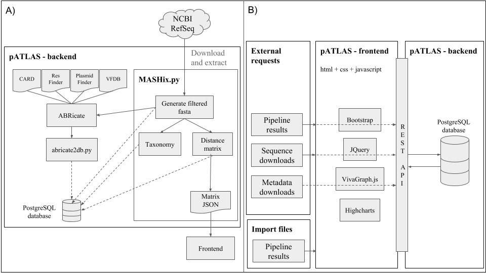

<p align="center">
  <a href="http://www.patlas.site">
    
  </a>
  <br/>
</p>

[](https://gitter.im/plasmidATLAS/Lobby?utm_source=badge&utm_medium=badge&utm_campaign=pr-badge&utm_content=badge)
[](https://www.codacy.com/app/tiagofilipe12/pATLAS?utm_source=github.com&amp;utm_medium=referral&amp;utm_content=tiagofilipe12/pATLAS&amp;utm_campaign=Badge_Grade)

# Table of contents

* [Description](#description)
* [Documentation](#documentation)
* [Development](#development)
    * [Dependencies](#dependencies)
    * [Backend scripts](#backend-scripts)
        * [MASHix.py](#mashixpy)
        * [Database customization](#database-customization)
    * [Supplementary scripts](#supplementary-scripts)
        * [abricate2db.py](#abricate2dbpy)
        * [taxa_fetch.py](#taxa-fetchpy)
* [pATLAS API](#patlas-api)
    * [Schematics](#schematics-of-the-patlas-database-creation)
    * [Workflow for database creation](#workflow-for-database-creation)
    * [Run pATLAS locally](#run-patlas-locally)
        * [Docker compose](#docker-compose)
        * [From scratch](#from-scratch)
    * [Optimization of the resources usage by the web page](#optimization-of-the-resources-usage-by-the-web-page)


# Description

[Plasmid Atlas](http://www.patlas.site) is a web-base tool that empowers
researchers to easily and rapidly access
information related with plasmids present in `NCBI's refseq` database.
In pATLAS each node (or circle) represents
a plasmid and each link between two plasmids means that those two plasmids
share around 90% average nucleotide identity.

With this tool we have two main goals:

1. Increase the accessibility of plasmid relevant metadata to users as
well as facilitate the access to that metadata.
2. Improve the ease of interpreting results from High Throughput Sequencing
   (HTS) for plasmid detection.

# Documentation

If are interested in learning how to use pATLAS, please refer to
[gitbook documentation](https://patlas.gitbook.io/docs).

---

# Development

## Dependencies

* **Mash** (2.0) - You can download mash version 2.0.0 directly here:
[linux](https://github.com/marbl/Mash/releases/download/v2.0.0/mash-Linux64-v1.1.1.tar.gz) and [OSX](https://github.com/marbl/Mash/releases/download/v1.1.1/mash-OSX64-v1.1.1.tar.gz). Other releases were not tested but may be downloaded in Mash git [releases page](https://github.com/marbl/Mash/releases).

* **Postgresql** (>= 10.0) - This script uses Postgres database to store the database:
[releases page](https://www.postgresql.org/download/)

* **Python 3** and the respective **pip**.

* To install all other dependencies just run: _pip install -r requirements.txt_

## Backend Scripts

### MASHix.py

MASHix.py is the main script to generate the database. This script generates
a matrix of pairwise comparisons between sequences in input fasta(s) file(s).
Note that it reads multifastas, i.e., each header in fasta is a reference sequence.

#### Options:

##### Main options:

```
'-i','--input_references' - 'Provide the input fasta files to parse.
                            This will inputs will be joined in a
                            master fasta.'

'-o','--output' - 'Provide an output tag'

'-t', '--threads' - 'Provide the number of threads to be used'

'-db', '--database_name' - 'This argument must be provided as the last
argument. It states the database name that must be used.'
```

##### MASH related options:
```
'-k','--kmers' - 'Provide the number of k-mers to be provided to mash
                sketch. Default: 21'

'-p','--pvalue' - 'Provide the p-value to consider a distance
                significant. Default: 0.05'

'-md','--mashdist' - 'Provide the maximum mash distance to be
                    parsed to the matrix. Default:0.1'
```

##### Other options:

```
'-no_rm', '--no-remove' - 'Specify if you do not want to remove the
                        output concatenated fasta.'

'-hist', '--histograms' - 'Checks the distribution of distances
                        values ploting histograms.'

'-non', '--nodes_ncbi' - 'specify the path to the file containing
                        nodes.dmp from NCBI'

'-nan', '--names_ncbi' - 'specify the path to the file containing
                        names.dmp from NCBI'

'--search-sequences-to-remove' - 'this option allows to only run the
                                 part of the script that is required
                                 to generate the filtered fasta.
                                 Allowing for instance to debug
                                 sequences that shoudn't be removed
                                 using 'cds' and 'origin' keywords'.
```

---

#### Database customization:

##### I don't like database name! How do I change it?

Go to `db_manager/config_default.py` and edit the following line:

```python
SQLALCHEMY_DATABASE_URI = 'postgresql:///<custom_database_name>'
```

##### I don't like table name inside database! How do I change it?

Go to db_manager/db_app/models.py and edit the following line:

```python
 __tablename__ = "<custom_table_name>"
```

---

#### Database migration from one server to another

##### Database export

```
pg_dump <db_name> > <file_name.sql>
```

##### Database import

```
psql -U <user_name> -d <db_name> -f <file_name.sql>
```

---

## Supplementary scripts

### abricate2db.py

This script inherits a class from
[ODiogoSilva/Templates](https://github.com/ODiogoSilva/templates) and uses it to
parse abricate outputs and dumps abricate outputs to a psql database, depending
on the input type provided.

#### Options:

```
"-i", "--input_file" - "Provide the abricate file to parse to db.
                        It can accept more than one file in the case of
                        resistances."

"-db_psql", "--database_name" - "his argument must be provided as the
                                last argument. It states the database
                                name that must be used."

"-db", "--db" - "Provide the db to output in psql models."

"-id", "--identity" - "minimum identity to be reported to db"

"-cov", "--coverage" - "minimum coverage do be reported to db"

"-csv", "--csv" - "Provide card csv file to get correspondence between
                    DNA accessions and ARO accessions. Usually named
                    aro_index.csv. By default this file is already
                    available in patlas repo with a specific path:
                    'db_manager/db_app/static/csv/aro_index.csv'"

```

### taxa_fetch.py

This script is located in `utils` folder and can be used to generate a
JSON file with the corresponding taxonomic tree. It fetches for a given
species, the genera, family and order to which it belongs.
Note: for plasmids I have to make some filtering in the resulting taxids
and list of species that other users may want to skip

#### Options:

```
-i INPUT_LIST, --input_list INPUT_LIST
                        provide a file with a listof species. Each
                        speciesshould be in each line.
-non NODES_FILE, --nodes_ncbi NODES_FILE
                        specify the path to the file containing
                        nodes.dmp from NCBI
-nan NAMES_FILE, --names_ncbi NAMES_FILE
                        specify the path to the file containing
                        names.dmp from NCBI
-w, --weirdos         This option allows the userto add a checks for
                        weirdentries. This is mainly usedto parse the
                        plasmids refseq, so if you do not want this to
                        be used, use this option.

```

##### List of entries that will be filtered from `weirdos` option

* From taxonomy levels:
    * "bug"
    * "insect"
    * "angiosperm"
    * "fungus"
    * "cnidarian"
    * "mudpuppy"
    * "mantid"
    * "mussel"

* From species in fasta headers:
    * "orf"
    * "unknown"
    * "Uncultured"
    * "uncultured"
    * "Peanut"
    * "Pigeon"
    * "Wheat"
    * "Beet"
    * "Blood"
    * "Onion"
    * "Tomato"
    * "Zea"
    * "Endosymbiont"
    * "Bacillaceae"
    * "Comamonadaceae"
    * "Enterobacteriaceae"
    * "Opitutaceae"
    * "Rhodobacteraceae"
    * "Bacterium"
    * "Endophytic"

* It also attempts to fix some bugs in species naming like the
following:
    * "B bronchiseptica"
    * "S pyogenes"

Note: Yes people like to give interesting names to bacteria...

# pATLAS API

## Schematics of the pATLAS database creation



## Workflow for database creation

1) Download plasmid sequences available in [NCBI refseq](ftp://ftp.ncbi.nlm.nih.gov/refseq/release/plasmid/)
2) Extract fasta from tar.gz
3) Download and extract [NCBI taxonomy](ftp://ftp.ncbi.nih.gov/pub/taxonomy/taxdump.tar.gz),
which will be fed to pATLAS.
4) Clone this repository:
```
git clone https://github.com/tiagofilipe12/pATLAS
```
5) Install its [dependencies](#dependencies)

6) Configure the database:
```
createdb <database_name>
pATLAS/patlas/db_manager/db_create.py <database_name>
```
7) run [MASHix.py](#mashixpy) - the output will include a filtered
fasta file (`master_fasta_*.fas`).
8) run [ABRicate](https://github.com/tseemann/abricate), with CARD,
ResFinder, PlasmidFinder, VFDB databases.
```
# e.g.
abricate --db card <master_fasta*.fas> > abr_card.tsv
abricate --db resfinder <master_fasta*.fas> > abr_resfinder.tsv
abricate --db vfdb <master_fasta*.fas> > abr_vfdb.tsv
abricate --db plasmidfinder <master_fasta*.fas> > abr_plasmidfinder.tsv
```
9) Download the [card index](https://card.mcmaster.ca/download/0/broadstreet-v2.0.2.tar.gz)
necessary for the abricate2db.py script (aro_index.csv).
10) run [abricate2db.py](#abricate2dbpy) - using all the previous tsv as
input.
```
# e.g.
abricate2db.py -i abr_plasmidfinder.tsv -db plasmidfinder \
    -id 80 -cov 90 -csv aro_index.csv -db_psql <database_name>
```
11) [dump database to a sql file](#database-export).

### Automation of this steps

This steps are fully automated in the nextflow pipeline
[pATLAS-db-creation](https://github.com/tiagofilipe12/pATLAS-db-creation).

### Creating a custom version of pATLAS

If you require to add your own plasmids to pATLAS database
without asking to add them to [pATLAS website](www.patlas.site),
you can provide custom fasta files when building the database using
the `-i` option of [MASHix.py](#mashixpy).
Then follow the steps [described above](#workflow-for-database-creation).

## Run pATLAS locally

### Docker compose

You can run pATLAS locally without much requirements by using
[patlas-compose](https://github.com/bfrgoncalves/patlas-compose). This
will automatically handle the installation of the version 1.5.2 of pATLAS
and launch the service in a local instance. For that you just require:

- [docker](https://docs.docker.com/install/#supported-platforms)
- [docker-compose](https://docs.docker.com/compose/install/)

Then, follow this simple steps:

- Clone the repository [patlas-compose](https://github.com/bfrgoncalves/patlas-compose).

```
git clone https://github.com/bfrgoncalves/patlas-compose
```

- Enter the *patlas-compose* folder

```
cd patlas-compose
```

- Launch the compose:

```
docker-compose up
```

- Wait for the line `* Running on http://0.0.0.0:5000/ (Press CTRL+C to quit)
` to show up, meaning that the service is now running.

- Access on `127.0.0.1:5000` or `0.0.0.0:5000`.

**Note: This methodology is highly recommended.**

### From scratch

pATLAS can be run locally if you have PostgreSQL installed and
configured. After, you just need to:

1) Clone this repository:
```
git clone https://github.com/tiagofilipe12/pATLAS
```

2) [Create your custom database version](database_creation.md#creating-a-custom-version-of-pATLAS)
 or [generate the default pATLAS database](database_creation.md) or
 [download sql file from version 1.5.2](https://github.com/tiagofilipe12/pATLAS/releases/tag/1.5.2)
 (the `tar.gz` archive).
 **Note:** if you download the sql file from version 1.5.2 you may skip
 steps 3 to 4 and **continue with step 5**.

3) Make sure all the necessary files are in place.

- by default pATLAS generates a `import_to_vivagraph.json` file in
  the folder `<tag_provided_to_o_flag>/results`. Place this file in the
  `patlas/db_manager/db_app/static/json` folder.
- change session to read the new `import_to_vivagraph.json` file by
  changing from `false` to `true` a variable named `devel` in
  `patlas/db_manager/db_app/static/js/pATLASGlobals.js`

4) Create the database that the front end will run:
```
createdb <your_database>
```

5) [load the generated sql file](https://github.com/tiagofilipe12/pATLAS#database-import)

6) Install backend dependencies:

```
# within the root directory of this repository
pip install -r requirements.txt
```

7) Install frontend dependencies:

```
# change directory to static direcoty where `index.html` will look for
# its depdendenies
cd patlas/db_manager/db_app/static/
# then install them (package.json is located in this directory)
yarn install
```

8) Compile node modules so that the html can understand, using webpack:

```
# You can also user a local installation of webpack.
# entry-point.js is the config file where all the imported modules are
# called
node_modules/webpack/bin/webpack.js entry-point.js
```

9) Then execute the script `run.py`.
```
# within the root directory of this repository
cd patlas/db_manager
./run.py <your_database>
```
Note: the database name is utterly important to properly say to the
frontend where to get the data.

10) Go to `127.0.0.1:5000`.

# Optimization of the resources usage by the web page

Using the `devel = true` isn't very efficient, so you can allow the
force directed graph to render in a `devel = true` session, then when
you are satisfied pause the force layout using the buttons available in
pATLAS and click at the same time `Shift+Ctrl+Space`. This will take a
while but eventually it will generate a file named `filtered.json`.
Once you have this file you can add it to the
`patlas/db_manager/db_app/static/json` folder and change the
`devel` variable to `false`. This will use the previously saved
positions to render a pre rendered network.

