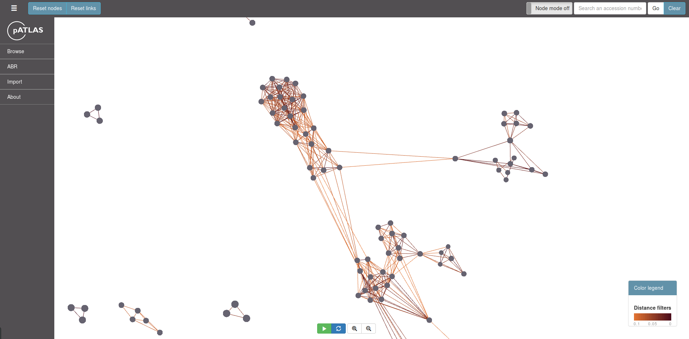
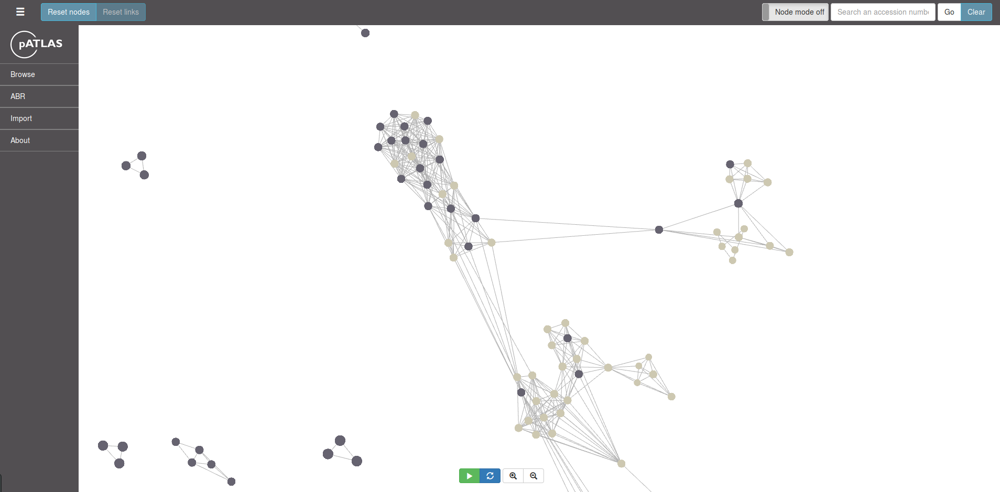
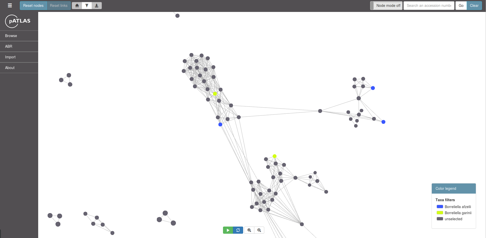
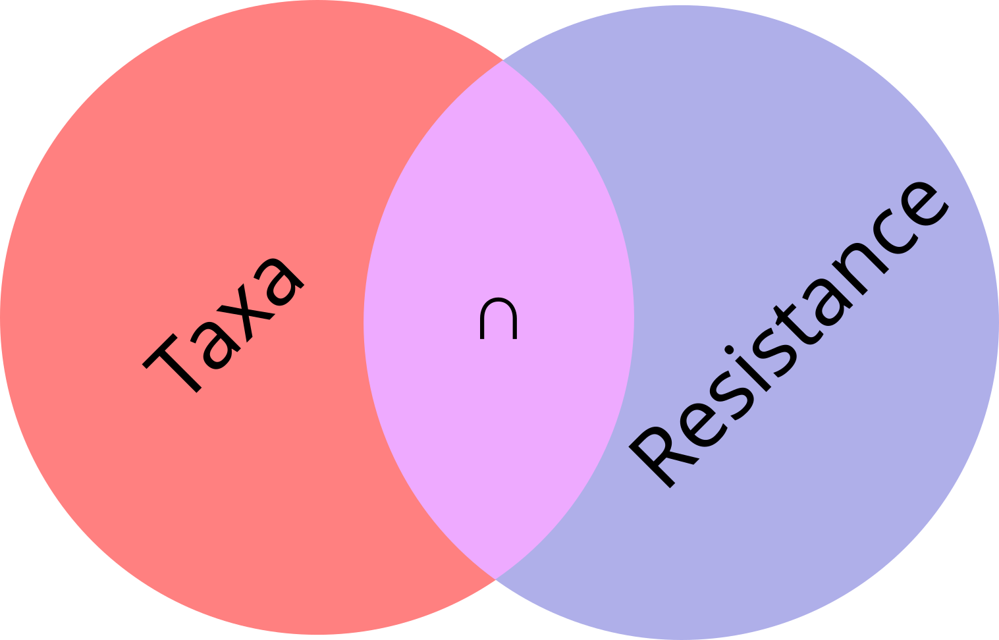
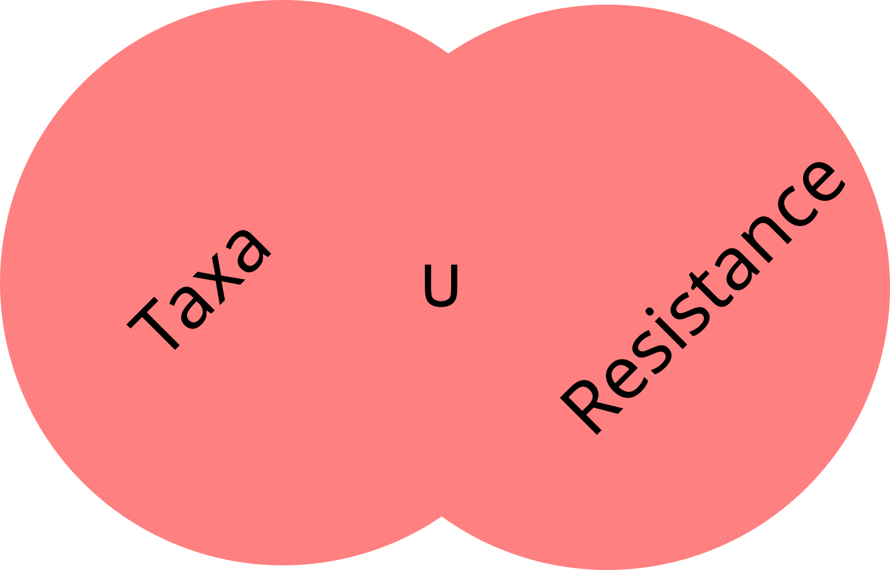

# Browse

Browse functions allow the user to explore the plasmid database used by 
plasmid ATLAS (pATLAS). pATLAS uses _refseq_ plasmid database from [NCBI](ftp://ftp.ncbi.nlm.nih.gov/refseq/release/plasmid/)
to establish the relationships between all plasmids available in the database
. For that, it uses [MASH](http://mash.readthedocs.io/en/latest/) to estimate the pairwise distances between all
plasmids. For a more detailed explanation on how are these relationships 
handled and displayed, please refer to [Relationships and distances estimations]
(distances.md)

**TOC**

* [Browse](#browse)
    * [Distances](#distances)
    * [Length](#length)
    * [Size ratio](#size-ratio)
    * [Taxa](#taxa)
* [Annotation](#annotation)
    * [Plasmid families](#plasmid-families)
    * [Resistances](#resistances)
    * [Virulence](#virulence)
* [Advanced](#advanced)
    * [Multiple](#multiple)

## Browse

### Distances

Distances are represented in **pATLAS** as grey links between nodes (dark grey 
circles). This options allows the user to display how closely related are a 
group of plasmids or a plasmid with another plasmid. It has three color 
schemes options: blue, green and red. You may choose which one you see fit. 

They might be selected using a simple dropdown menu, in which you have
three color schemes

The darker the color is the smaller is the distance estimated by MASH and thus 
the more closely related (more similar) are the two plasmids that are linked 
by the link.

### Length

You may also filter by lenght of the plasmids present in the database. To do 
so, you select the **By Length** option under the **Browse** submenu, which 
will open a smaller windows above the visualization. Then, you may use both 
the slider and the boxes for minimum and maximum limits which will change the
 selected nodes (plasmids). Dark grey plasmids are within the current 
 interval of selected lengths, whereas lighter grey plasmids are outside the
 selected interval.
 
 

### Size ratio

This option allows users to filter links that have plasmids with very different
sizes. E.g. some plasmids may have a high mash dist (> 0.9) but one of the
plasmids may be a lot smaller than the other. This ratio allows
to specify a percentage between the smaller and the larger plasmid,
connected by a link:

`Size Ratio = 1 - (smaller plasmid length / larger plasmid length)`

The cutoff that the user should provide in this popup, is the maximum
percentage difference between the two plasmids. So, if we set it
to 30 (30% in fact) this will tell pATLAS to highlight or remove all the connections that
have more than 30% difference in size between pairs of plasmids.

### Taxa

In this option you may select a multitude of taxa filters ranging from order,
 family, genus to species. This will select with different colors each of the
  selected taxa. For instance, if you select _Borreliella afzelii_ and
  _Borreliella garinii_, this will color plasmids identified in the each
  of the two species with different colors.

  _Example_

  

  *NOTE:* However, if you select a genus and a species, or a family and a
  species
  (and so on), this will color all the selected plasmids in red.

## Annotation

### Plasmid families

This option allows users to color plasmids (nodes) present in pATLAS by
selecting genes available in PlasmidFinder database. For that a dropdown
with all genes present in this database is available for the user and
searches are enabled with live filter of resulting genes.

Citation:
* [Carattoli, A., Zankari, E., García-Fernández, A.,
Larsen, M. V., Lund, O., Villa, L., Aarestrup, F. M., Hasman, H.
(2014). In Silico detection and typing of plasmids using plasmidfinder and
plasmid multilocus sequence typing. Antimicrobial Agents and Chemotherapy,
58(7), 3895–3903.](https://doi.org/10.1128/AAC.02412-14).

### Resistances

Resistances (CARD and Resfinder databases) highlight plasmids with the selected resistances by the user.

Citations:
* [Zankari, E., Hasman, H., Cosentino, S., Vestergaard, M.,
Rasmussen, S., Lund, O., Aarestrup, F. M., Larsen, M. V. (2012).
Identification of acquired antimicrobial resistance genes. Journal of
Antimicrobial Chemotherapy, 67(11), 2640–2644.](https://doi.org/10.1093/jac/dks261)
* [Jia, B., Raphenya, A. R., Alcock, B., Waglechner, N., Guo, P.,
Tsang, K. K.,  Lago B. A., Dave B. M., Pereira S., Sharma A. N.,
Doshi S., Courtot M., Lo R., Williams L. E., Frye J. G., Elsayegh T.,
Sardar D., Westman E. L., Pawlowski A. C., Johnson T. A.,
Brinkman F. S., Wright G. D.,
 McArthur, A. G. (2017). CARD 2017: Expansion and
model-centric curation of the comprehensive antibiotic resistance
database. Nucleic Acids Research, 45(D1), D566–D573.](https://doi.org/10.1093/nar/gkw1004)

### Virulence

Virulence genes available in VFDB databsae

Citation:
* [Chen L, Yang J, Yu J, et al. VFDB: A reference database for
bacterial virulence factors. Nucleic Acids Res. 2005;33(DATABASE ISS.)
:D325-D328. doi:10.1093/nar/gki008.](https://academic.oup.com/nar/article/33/suppl_1/D325/2505203)

## Advanced

A set of filters with advanced filters for users that want to combined
multiple browsing filters.

### Multiple

In this menu the users may combined different filter between each one
of the available levels of browsing filters:

* Taxa,
* Plasmid Families,
* Resistances,
* Virulence.

It is allowed to select multiple entries in one of the dropdowns for
each level. So, for instance if you are interested in selecting
`Straphyloccocus` **OR** `Enterococcus` from the genera dropdown, you
are allowed to do it. The selection made within each filter level will
behave as a sum of the selected entries. However, if you select a filter
from another level, for example, select `VanA` gene from the CARD
dropdown will behave as a intersection or union depending on which one
of the following buttons is clicked:

The **`Submit intersection`** button will make an intersection between two
taxa levels. For example:

In the above example the resulting visualization will highlight the
plasmids that share in common the selected Taxa **AND** the selected
resistance. So, you will get the purple intersection.

The **`Submit union`** button will make a literal union between each one
of the levels. For example:

In the above illustration the taxa and resistance selections will be
summed and displayed as a single color. So you will get the full red
universe.
