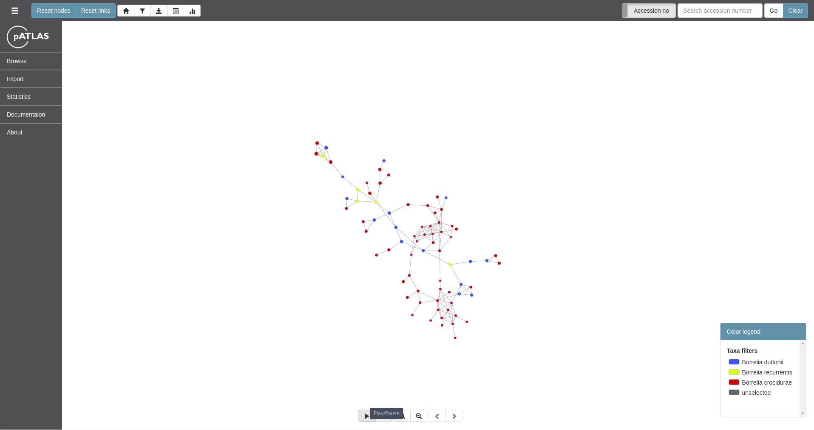

  
   

# Introduction

Welcome to [pATLAS](http://www.patlas.site), the plasmid atlas.

## Briefly

pATLAS is a web-base tool that empowers researchers to easily and rapidly access
information related with plasmids present in `NCBI's refseq` database.
In pATLAS each node (or circle) represents
a plasmid and each link between two plasmids means that those two plasmids
share over 90% average nucleotide identity.

With this tool we have two main goals:

1. Increase the accessibility of plasmid relevant metadata to users as
well as facilitate the access to that metadata.
2. Improve the ease of interpreting results from High Throughput Sequencing
   (HTS) for plasmid detection.

## Main features

* Browse by taxa.
* Browse by resistance genes.
* Browse by plasmid families.
* Browse by virulence genes.
* Import JSON files from mapping results, mash screen results and mash
dist results (for assemblies).
* Generate many plots for custom selections.
* Download sequences for selected plasmids.
* Display metadata for one plasmid or multiple selected plasmids.
* Ability to share projects between sessions and users.

## Citation

Tiago F Jesus, Bruno Ribeiro-Gonçalves, Diogo N Silva, Valeria Bortolaia, 
Mário Ramirez, João A Carriço; Plasmid ATLAS: plasmid visual analytics and 
identification in high-throughput sequencing data, Nucleic Acids Research,
gky1073, [https://doi.org/10.1093/nar/gky1073](https://doi.org/10.1093/nar/gky1073)
