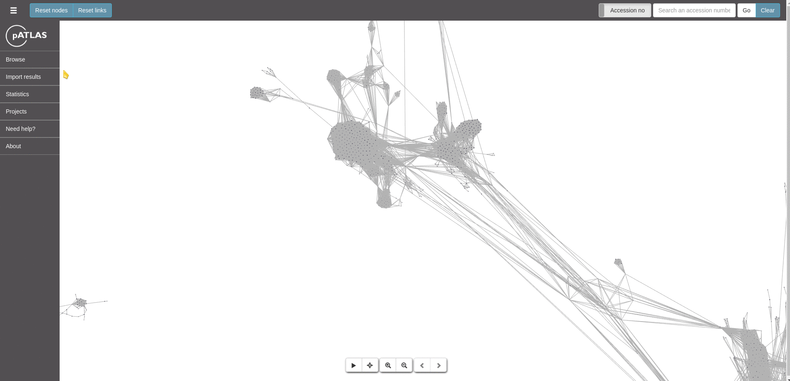

# Projects

Plasmid Atlas now supports projects! You can now save your current
session for sharing with someone or just to return to that session
later. So, users may now make multiple selections, using multiple
filters, such as `Taxa`, `Resistance` or even results from **file
Imports** and visualize them later or share with someone in a different
computer.

## Saving a project

To save a project users just have to make their custom selections and
go to the [Sidebar Menu](Sidebar.md) and select Projects -> Export.
Then you can save your project with a custom name provided to the input
text box available or if you leave it empty it will save with the
default naming: `my-patlas-project.json`.



## Importing a project

Once you have a project generated in pATLAS from a previous session or
from a co-worker that gently sent it to you, you can load it through
the [Sidebar Menu](Sidebar.md) and select Projects -> Import.
Then on that menu you select the file you want to import and the
**view** that you wish to use on the first interaction.


### Views

**Views** are abstractions used so that users can see different layers
on each node (plasmid), otherwise if a project has many selections (e.g.
Taxa + Resistances + Imported file) it would render an endless number
of different color combinations on the graph. Therefore, and to avoid
the visualization to be overpopulated with information, we added
**views** that basically display one of the filters at once. In this
sense, you can select Taxa view as the first view after importing a file
and the nodes (plasmids) will be colored by Taxa. Then, you may select
other view through the dropdown menus.

## Advanced usage

### Use custom selections through project files

Selections can be made in specific menus by importing a project file
instead of selecting many options in the dropdown menus.

#### Example usage example

Imagine you want to select 50 taxa from the dropdown menus. Doing it by
clicking 50 times in the dropdown menu may take a while and be
extremely boring. However, using the project import option one can
create a file with a structure like the following:

```
{
  "taxa": ["Escherichia coli", "Staphyloccocus aureus", ...],
  "resistance": false,
  "plasmidfinder": false,
  "virulence": false,
  "intersection": false,
  "union": false,
  "mapping": false,
  "mashscreen": false,
  "assembly": false,
  "consensus": false
}
```

So you can add a list of selections you require to the respective fields
on the object described above.