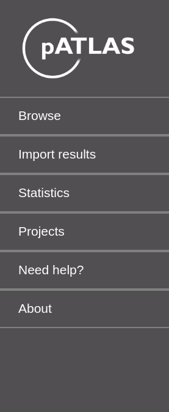

# Sidebar menu

Clicking the sidebar menu 
will open a dropdown with six buttons:

## Browse

**Browse** has all filtering related options that allow the user to
make custom selections and highlights on both nodes and links.

## Import results

**Import results** has a series of options that allow the user to
import `JSON` files from [pATLASflow](https://github.com/tiagofilipe12/pATLASflow).
Further instructions are provided in the "How to run" sections of the
desired Import option.

## Statistics

**Statistics** allows to calculate the desired statistics (e.g.
taxa, resistance genes or length) and plot them in a chart.

## Projects

**Projects** has two buttons, one for exporting and another for importing
projects. This module provides an easy and rapid way for users to share
results, save a current session or load a previously saved session.

## Need help?

#### Documentation

**Documentation** will open this `gitbook`.

#### Video tutorial

**Video tutorial**  will open a popup with a playlist of short tutorials
that display pATLAS key features.

#### FAQs

A set of questions that may occur to users when using pATLAS. 

#### Report sequence.

Here users can report any problem that they find with a plasmid available in 
pATLAS. For instance, if there is a gene sequence rather than a plasmid. This
is part of the _crowd curation_ of pATLAS, which is an initiative that aims to
ease the curation of the database by users that find an issue with a RefSeq
sequence that shouldn't be a plasmid. pATLAS already has some filters that
prevent non-plasmid sequences from getting into the database, however 
in each database update it is expected that new issues may arise, thus we
acknowledge every contribution to help us curate the database.

When clicked, this button will open a pre-formatted GitHub issue like the one below:

The user reporting will have to replace `<brief title of the issue>` with the
desired title and then the body of the issue is already pre-filled with
two headers:

* `Sequences accessions` - In which the users should state the accession numbers
of the sequences that have issues.

* `Description of the issue` - Here the users should state the reason by which 
the sequence should be removed/curated from the pATLAS plasmid database.

## About

**About** contains a brief description of pATLAS and contributions for
the development of the tool.
