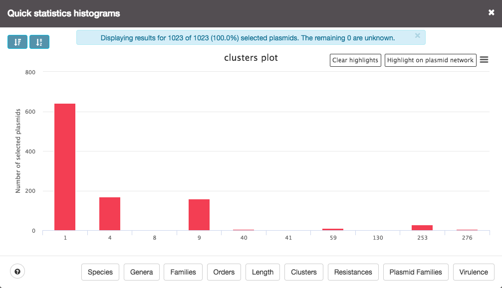

# Statistics

pAtlas provides the user with many capabilities concerning the 
visualization of the results' distribution. It allows to have an overview
of the number of selected plasmids that belong to a given
**species**, **genus**, **family** or **order**. This visualization can be
performed a given selection, either with the area selection tool (shift + mouse click and dragging)
(for more details on [Graph interaction](graph.md#area-selection)), or
with the filters or imports. 

> The Statistics shown are dependent on the selection performed. For a reset
 click on the **reset nodes** button located at the top of the pATLAS interface.

## Taxa

Bar plot with the number of occurences of each taxa (Species, Genera, Families and Orders)
in the current selection.

## Annotation

Similar to [Taxa plots](Statistics.md#Taxa), but with information on
resistance and virulence genes, and plasmid families.

##Other

#### Length

Length of all selected plasmids. This plot presents two series:

* **Scatter**, which shows the length of each plasmid individually.
 
* **Histogram**, which shows the size distribution in the selected plasmids. 

This plot is interactive, allowing clicks on the scatter points (plasmids) to highligh it's 
respective bin, or vice versa. 

#### Clusters

Plasmid distribution per cluster. The cluster are defined by plasmids that share links 
with each other.

## Additional plot options

In each statistics plot there are additional plot options that can be explored:
* At the **top left corner** of the plot window:
    * A button to **sort in descending order** of values in `y axis`.
    * A button to **sort in alphabetic order** of the legend in the `x axis`.

* At the **bottom left corner** the plot window:
    * a **question mark** button that shows **additional controls** to use in the plot area.
     `Ctrl + left mouse` click will enable panning of the plot and `left mouse click + dragging`
      will enable zooming in a given area of the plot.

* At the **top right corner** of the plot window:
    * **export options** for the plot:
        * Print the plot
        * Save to file:
            * PNG
            * JPEG
            * PDF
            * SVG
    * A **Clear highlights** button to clear all highlights made in the plot.
    * A **Highlight on plasmid network** button update the selection made in 
    the plasmid network for the plasmids contained in the selected bars. 
    Only available for bar plots.

## Make selections using the barplots

It is possible to make selections using the bar plots available in pATLAS, 
either in the [Taxa](statistics.md#Taxa) or [Annotation](statistics.md#Annotation) plots.

 
 (Note: the final image doesn't seem to have selections but there are some nodes with an halo
 around them. In pATLAS they will appear in green. Also, bars will not be grey but instead they
 will turn red when clicked.)