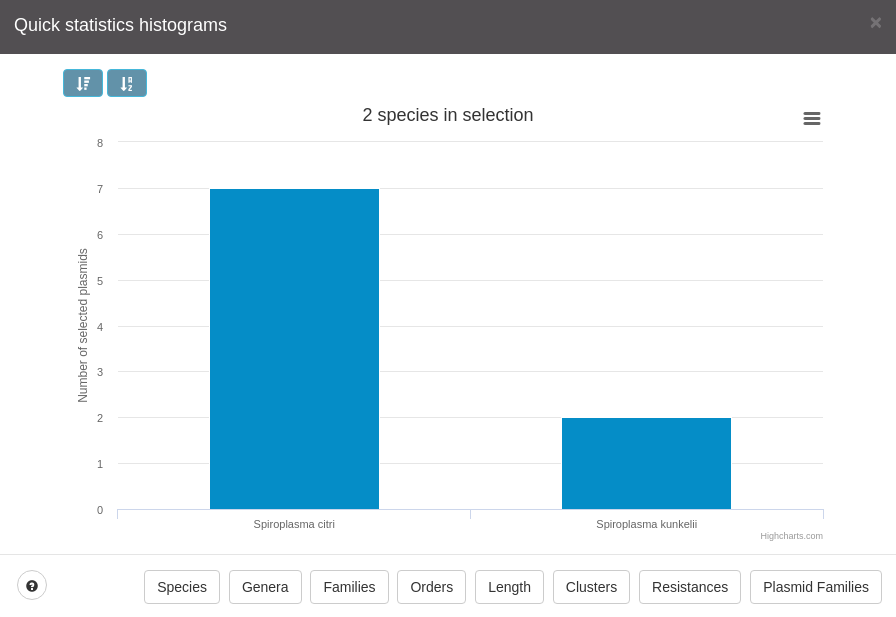
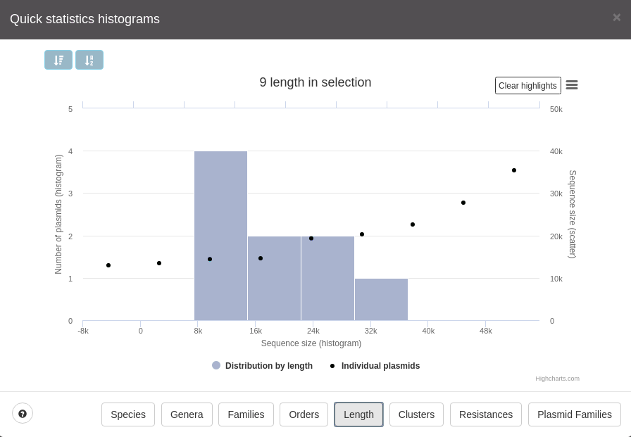
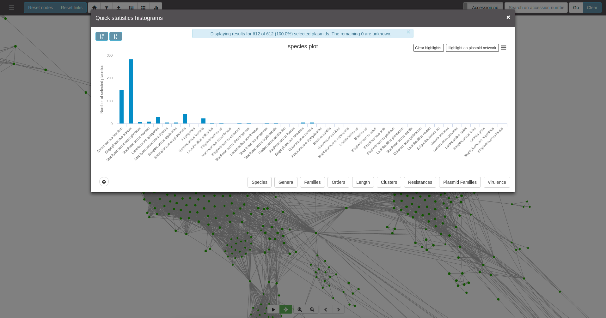

# Statistics

Plasmid Atlas provides the user with many capabilities in what concerns the 
visualization of the distribution of the results. For instance users may 
visualize the number of selected plasmids that belong to a given
**species**, **genus**, **family** and **order**. Users have many more
options available but the idea is for the user to perform a given selection 
either with the area selection tool (shift + mouse click and dragging)
(for more details on these features check [Graph interaction](graph.md#area-selection)) or
with the filters / imports (in fact any node that has color will be taken 
into account for statistics module). 

> Because pATLAS can't know for the user which plasmids you are interested 
in, the user must be aware of the selection that has been performed. So, if 
you are unsure of the selection that you have made user the **reset nodes** 
button and make your selection from start.

## Available options

### Species, Genera, Families and Orders

This will basically generate a bar plot with the number of occurences of each taxa
in the current selection.

### Length

This will show the lengths of all selected plasmids. However, this plot
presents two types of series:

* Scatter, which shows the length of each plasmid individually.
* Histogram, which shows the distribution of length in the selected plasmids

This plot allows to click either on a given point (plasmid) or on a given bar,
enabling to highlight its respective bar or points, respectively.

### Resistances, virulence and plasmid families

Pretty much the same as [Taxa plots](#available-options), but for
the information on resistances and plasmid families.

## Plot additional buttons

* top left corner of popup:

    * A button to sort in descending order of values in `y axis`.

    * A button to sort in alphabetic order of the legend in the `x axis`.

* bottom left corner of popup:

    * a question mark button that will show you additional controls to
    use in plot area. `Ctrl + left mouse` click will enable panning of the plot and
    `left mouse click + dragging` will enable zooming in a given area of the plot.

* top right corner of the popup:

    * export options for the plot, ranging from:
        * Print the plot
        * Save to file:
            * PNG
            * JPEG
            * PDF
            * SVG
    * Clear highlights - This button will clear all highlights made in plots.
    * Highlight on plasmid network - This button will be available for
    bar plots when the user clicks on one or several bars. This will allow
    users to filter the previous graph interaction for the selected bars,
    i.e., this button will update the selection made in the plasmid network
    so that it will only highlight in **green** the selected plasmids.

## Make selections using the barplots

It is also possible to make selections using the bar plots available in pATLAS,
 i.e. in Taxa related, resistancec, virulence and plasmid families plots.

 Example usage:

 
 (Note: the final image doesn't seem to have selections but there are some nodes with an halo
 around them. In pATLAS they will appear in green. Also, bars will not be grey but instead they
 will be red when clicked.)

Users can use `Clear highlights` button or click on a selected bar to deselect
all or the clicked bar.