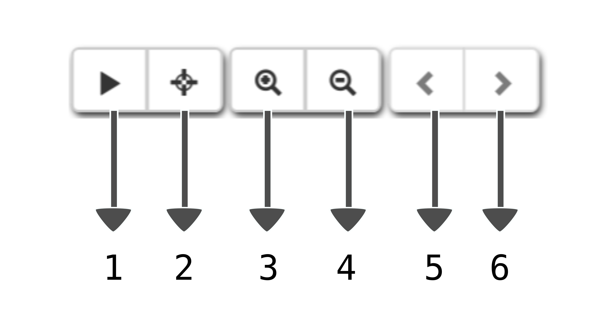

# Graph interaction

There a handful of event interactions that are possible with the
plasmid network in pATLAS.

## Bottom buttons

At the bottom and center of the page there are 6 buttons, 4 enabled
and 2 disabled by default.

1. [Play/Pause button](#play-and-pause)
2. [Area selection](#area-selection)
3. [Zoom in](#zooming-buttons)
4. [Zoom out](#zooming-buttons)
5. [Slide file to left](#arrow-buttons)
6. [Slide file to right](#arrow-buttons)

### Play and Pause

The leftmost button with a `play` sign allow
the force directed layout to start computing again. By default the
force layout is paused in order to consume less resources, however for
instance after filtering the current selection the user may feel the
need to further render the graph (separate the plasmids from each other).
This button will change the behavior after being clicked, and then if
clicked again it will pause the force layout.

### Area selection

The second leftmost button allows the user to make area selections using
`shift key + left mouse dragging` to select plasmid in a rectangular area.
Releasing `shift key` or `left mouse click` will release the selection area
and maintain the selected plasmids in a green color.
To disable this mode, click this button again and it will turn grey again
and lock area selection.

### Zooming buttons

At the middle of these 6 buttons there are two buttons that control the
zooming level, a zoom in button and a zoom out button.

### Arrow buttons

The two arrow buttons on the rightmost side of these 6 buttons are disabled
by default and they are only enabled when multiple `JSON` files are loaded
through the import of mapping, mash screen or sequence results.

## Click event on nodes

Nodes can be clicked and a popup will open with the metadata for that plasmid.
See [plasmid popup](plasmid_popup.md).
