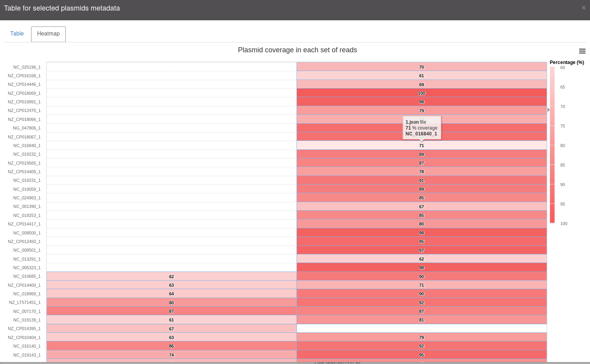

# Heatmap

The heatmap is used in combination with the imports from mapping or
mash screen, where the user can import multiple file (for further
details on this check [Import](Import.md). The heatmap button is available
once user makes a first selection in the top navigation bar.
Although it will only show results if import files from mapping, mash screen
or sequence JSON files are provided.

This heatmap,
allows users to quickly see the plasmids present in two or more
different sets of reads. See the example below:

This features the same exports as the
[plots for Statistics](Statistics.md#plot-additional-buttons).