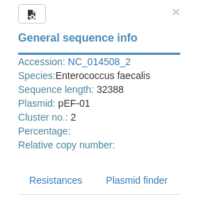
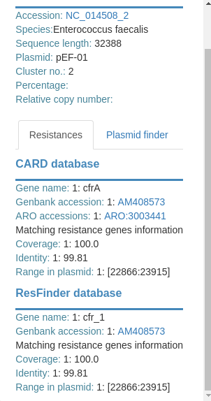
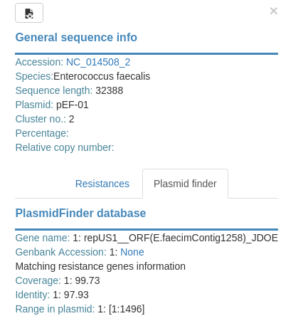

# Plasmid popup

By default popup will show metadata like this:

Then, as you may notice there are two buttons in the bottom that can be
clicked, displaying information for:

* Resistances

* Plasmid families

This popup also features a button at the top left corner that allows to
export all displayed data into a csv file that can be imported in any
spreadsheet.