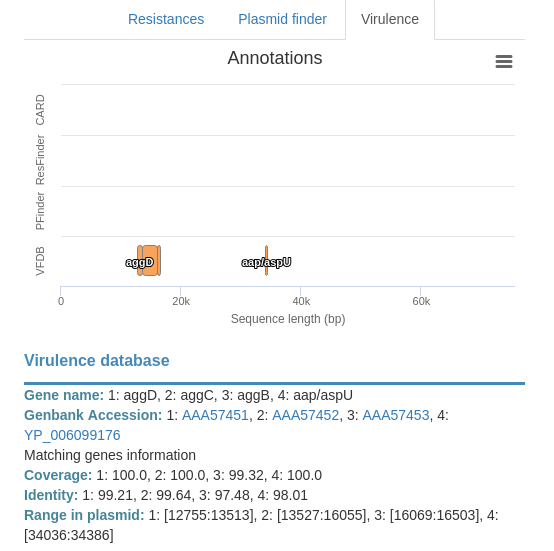
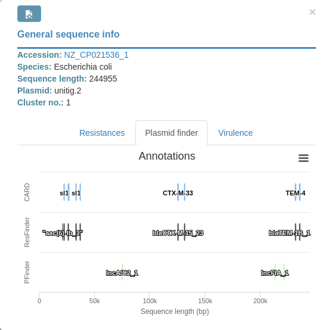

# Plasmid popup

By default popup will show metadata like this:

Then, as you may notice there are three buttons in the bottom that can be
clicked, displaying information for:

* Resistances genes

* Plasmid families

This popup also features a button at the top left corner that allows to
export all displayed data into a csv file that can be imported in any
spreadsheet.

* Virulence genes

## Annotation chart

All these annotations in the popup will be summarized a chart like this:

This chart is interactive and you may **zoom in** (by dragging the mouse
while holding left mouse button) and use a sliding window (by pressing `ctrl`
key and dragging the left mouse button).